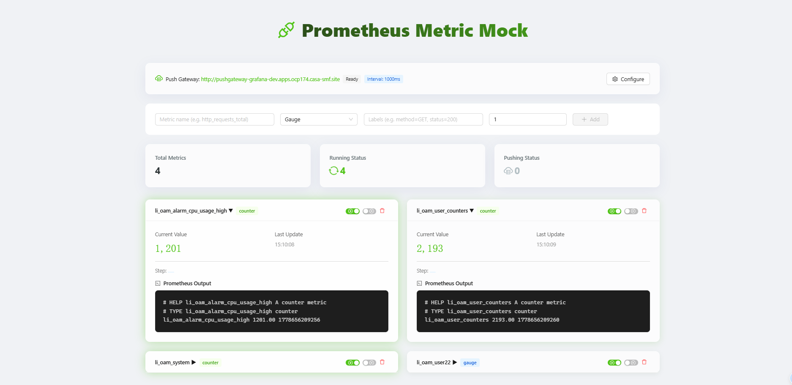

# Prometheus Metric Mock

模拟 Prometheus 指标的可视化工具，支持实时数据生成和 Push Gateway 推送。



## 功能特性

- **创建指标** - 支持自定义指标名称、类型（gauge/counter/histogram/summary）和标签
- **自定义步长** - 支持设置 Step 步长，控制数据变化的剧烈程度
- **实时模拟** - 自动生成模拟数据，支持多指标并发运行，可配置全局推送间隔
- **动态视觉反馈** - 开启数据生成时，指标卡片会有明显的轮转动画边框
- **Push Gateway 并发推送** - 支持多个指标同时向 Push Gateway 推送数据，互不干扰
- **即时推送响应** - 开启推送开关时立即执行一次推送，随后进入定时任务
- **自动 Job 命名** - 每个指标使用自身名称作为 Push Gateway 的 Job 名称
- **连接测试** - 可在保存配置前测试 Push Gateway 连接是否正常
- **暂停/恢复** - 单独控制每个指标的运行状态
- **卡片折叠** - 点击指标名称可折叠/展开详情
- **数据持久化** - 使用 localStorage 保存配置，刷新页面不丢失
- **可视化输出** - 实时显示 Prometheus 格式的指标数据

## 运行

```bash
pnpm i
pnpm run dev
```

访问 http://localhost:5173

## 使用方法

### 1. 配置 Push Gateway

点击顶部的 "Configure" 按钮，填写：
- **Push Gateway URL** - Push Gateway 地址（必填）
- **Push Interval** - 推送和生成数据的间隔时间，必填，最小值为 500ms（默认 2000ms）

点击 "Test Connection" 可测试连接，配置完成后点击 "Save" 保存。

### 2. 添加指标

在顶部表单中：
- 输入指标名称（如 `http_requests_total`）
- 选择指标类型
- 可选添加标签（如 `method=GET,status=200`）
- 设置步长 Step（控制每次变化的幅度）
- 点击 "Add"

### 3. 控制指标

卡片标题栏：
- **指标名称** - 点击可折叠/展开卡片详情
- **Type 标签** - 显示指标类型
- **Pushing 标签** - 推送中时显示
- **Generate Metric 开关** - 控制指标是否持续生成。开启时，卡片背后会出现**绿色的放射状呼吸光效**，主体背景保持半透明，视觉上非常柔和且明显。
- **Push 开关** - 控制是否推送到 Push Gateway（支持多指标同时推送）。开启时，卡片边缘出现**蓝色的旋转光束**，内部背景保持静止。
  > **Note**: 当同时开启生成和推送时，蓝色光束在边缘转动，同时卡片内部透出绿色的呼吸光效，两者完美重叠互不干扰。

### 4. 卡片详情

点击指标名称展开卡片后，可查看：
- **Current Value** - 当前值
- **Last Update** - 最后更新时间
- **Labels** - 标签（如有）
- **Step** - 步长设置
- **Prometheus Output** - Prometheus 格式的输出

## Push Gateway 推送规则

每个指标会推送到 `{PushGatewayURL}/metrics/job/{metric_name}`，例如：
- 指标名 `http_requests_total` → 推送到 `/metrics/job/http_requests_total`
- 指标名 `li_oam_user_counters` → 推送到 `/metrics/job/li_oam_user_counters`

## 指标类型

| 类型 | 描述 | 生成行为 |
|------|------|----------|
| Gauge | 当前值，可增减 | 在当前值基础上随机 +/- (1 ~ Step) |
| Counter | 单调递增计数器 | 在当前值基础上递增 (1 ~ Step) |
| Histogram | 直方图 | 模拟分布数据（目前为 0-1000 随机值） |
| Summary | 摘要 | 模拟分位数数据（目前为 0-1000 随机值） |

开启 "Generate Metric" 开关后，数值会根据配置的间隔（Push Interval）持续更新。

## 配置持久化

所有配置（指标列表、Push Gateway 设置）会自动保存到 localStorage，刷新页面后自动恢复。

## 项目结构

```
src/
├── types.ts              # 类型定义
├── utils.ts              # 工具函数
├── components/
│   ├── MetricCard.tsx    # 指标卡片组件
│   ├── MetricForm.tsx    # 添加指标表单
│   └── ServerConfigModal.tsx # 配置弹窗
└── App.tsx               # 主组件
```